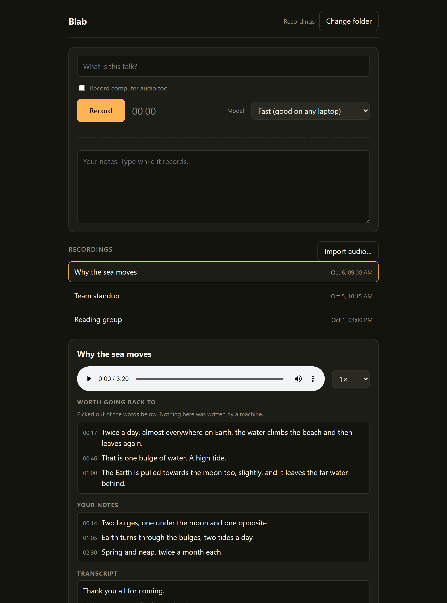
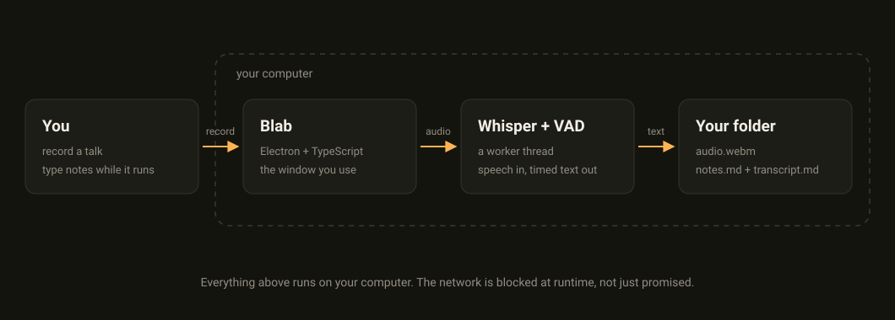

# Blab

Record a talk. Type your notes while it runs. Press stop and it writes the
transcript on your own computer.

No account. No login. No cloud. No API key. No subscription. Nothing leaves
your machine.

Windows, Mac and Linux. Free. Open source. Offline.



## Get it

### The easy way

1. Open the [releases page](https://github.com/jurecerkez-code/Blab/releases/latest).
2. Under Assets, download the file for your computer:

| Your computer | The file to download |
|---------------|----------------------|
| Windows | `Blab-Setup-*.exe` |
| Mac | `Blab-*.dmg` |
| Linux | `Blab-*.AppImage` |

The `*` is the version number. Everything on that page is the newest
version, so just take the one for your computer. One Mac file works on every
Mac, old or new. The Linux file installs nothing.

The download is big, about 758 MB, because all three speech models are
inside it. That is the whole point: nothing to download later, works offline
forever, even if this repository disappears tomorrow.

3. Run it:
   - **Windows:** double-click the file. Windows shows "Windows protected
     your PC". Click **More info**, then **Run anyway**. That screen is there
     because Blab is not signed (a certificate costs 99 dollars a year) and
     Blab is free. It installs for you alone and asks for no administrator
     password.
   - **Mac:** open the dmg and drag Blab into Applications. The first time
     you open it, macOS says it cannot verify the app. Go to System Settings,
     Privacy & Security, scroll down, click **Open Anyway**. Same reason:
     unsigned, free.
   - **Linux:** `chmod +x Blab-*.AppImage && ./Blab-*.AppImage --no-sandbox`.
     On Ubuntu 22 and older, run `sudo apt install libfuse2` first. The
     `--no-sandbox` flag is a Chromium thing, not a Blab bug.

4. Open Blab. Pick a folder. Type a title. Press Record.

That is the whole setup.

### The one-command way

If you live in a terminal, one line downloads the right file and installs
it. Never opened a terminal? It is the black window app: on Windows, press
Start and type PowerShell; on Mac, press Cmd+Space and type Terminal. Paste
one of these and press Enter:

**Mac and Linux**
```
curl -fsSL https://raw.githubusercontent.com/jurecerkez-code/Blab/main/scripts/install.sh | sh
```

**Windows (PowerShell)**
```
irm https://raw.githubusercontent.com/jurecerkez-code/Blab/main/scripts/install.ps1 | iex
```

Neither asks for an administrator password, both scripts are short, and you
can read them before you run them. They download the installer once; the app
itself never touches the network again.

## How it works

1. Open Blab. Pick a folder. This is the only choice you ever make.
2. Type a title. Press Record.
3. Type your notes while the talk runs.
4. Press Stop. The transcript appears next to your notes. Click a line and
   the audio plays from that moment.

Every recording is three plain files in the folder you picked: `audio.webm`,
`notes.md`, `transcript.md`. No database. Open them in any editor, move them
anywhere, keep them forever.

The first time it starts, Blab picks the speech model for your machine (Best
on Apple Silicon, Balanced on a modern laptop, Fast on an old one). You can
change it in the picker. That is all the configuration there is.

Also in there, once you need it:

- Live captions while recording, so a mic problem is visible before the talk
  ends.
- Record the computer's audio too, for meetings (Windows only, mixed into
  the same file).
- Import an existing audio file and get the same transcript treatment.
- Export subtitles (`.srt`, `.vtt`), or copy one clean text block for
  pasting into anything.
- "Worth going back to": the lines the talk kept returning to, and the ones
  you wrote notes near, picked out of your own words with nothing invented.

## If something goes wrong

| What you see | What it means |
|--------------|---------------|
| The bars stay flat while you talk | Blab cannot hear you. Wrong microphone, muted, unplugged. Fix it before the talk, not after. |
| The transcript repeats one phrase forever | Whisper got stuck, because the microphone was too far away. Record again with the mic closer. |
| Blab says the transcript looks like a loop | Same thing, said out loud instead of hidden. That is the feature. |
| The window must stay open while it transcribes | There is no tray icon. Closing the window stops the job. The audio and notes are already saved. |

## What it does not do

- No account. No login. No onboarding flow.
- No cloud. It cannot reach the internet at all. That is not a promise in a
  README, it is a rule the app runs under that blocks every outgoing
  connection. The source is public, go and try to break it.
- No subscription. Nothing to renew. No upgrade to Pro.
- No auto-update. Download once, it works forever.
- No telemetry. No analytics. No "AI companion".

## How it is built

For people who like machinery. Blab works fine if you skip this.

- **Whisper runs in the app.** No server, no API.
  `@huggingface/transformers` runs quantized Whisper in a web worker on
  WebAssembly threads. It is the only runtime dependency; everything else is
  the platform (Electron, the File System Access API, Web Audio).
- **Silence is skipped before transcription.** A Silero voice-activity
  detector, driven directly against the app's own copy of onnxruntime, cuts
  silence out before Whisper sees it. Fewer loops, faster runs, and every
  timestamp maps back to the original recording.
- **98 tests, no model needed.** The suite drives the real modules in a
  browser (decode, VAD windows, the job queue, atomic file writes, the
  exports), and CI runs it plus the typecheck on every pull request.
- **One config, three platforms.** Pushing a tag builds the Windows
  installer, one universal Mac dmg (Intel + Apple Silicon) and the Linux
  AppImage on GitHub runners, and leaves them on a draft release for review.
- **Rejected, with reasons.** Beam search: the bundled engine has none, the
  flag does nothing (verified against its source). WebGPU: it needs fp32
  weights that triple the download, for no gain at these sizes. Both were
  measured, and the reasons live in the code so nobody asks twice.
- **Small on purpose.** About 4,300 lines of source in `src/`, no native
  dependencies.



### Build it yourself

```
git clone https://github.com/jurecerkez-code/Blab.git
cd Blab
npm install
npm run setup        # downloads the models once, needs internet
npm run dev          # the app in a browser tab
npm run app          # the desktop app
npm run app:check    # mic, model and worker; all four lines must say ok
npm run package      # installer for your OS
```

## Licence

MIT. What changed in each version lives on the
[releases page](https://github.com/jurecerkez-code/Blab/releases).
